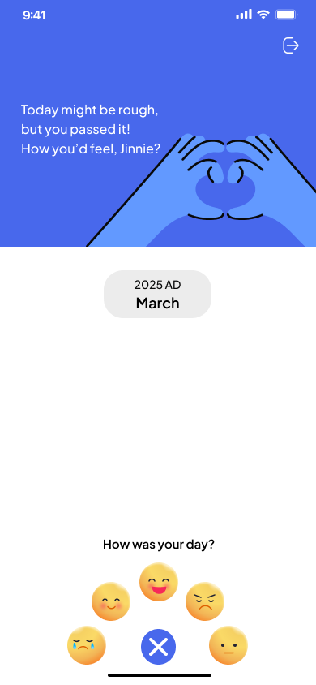
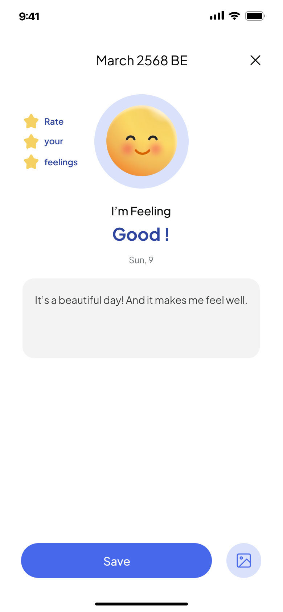
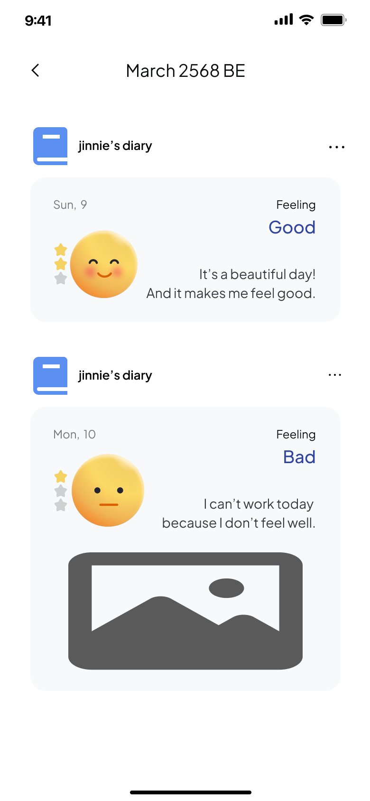
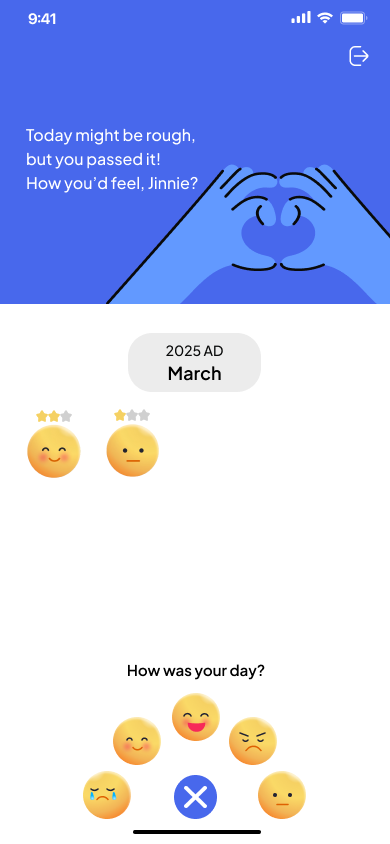

# 🌙 MoodKit

MoodKit is a mobile mood-tracking application built with **.NET MAUI (C#)**, designed to help users **record, understand, and improve their emotional well-being** through daily mood logs and simple visual analytics.
This project was created as a learning and practice app for mobile development and UI/UX design integration between **Figma and .NET MAUI**. 💫

---

## ✨ Features

* 🧠 **Daily Mood Tracking** – Add, edit, or delete your daily mood entries easily.
* 📊 **Mood Statistics Dashboard** – Visualize your emotional trends using simple charts and summaries.
* 💬 **Personal Notes** – Write down short notes or reasons behind each mood.
* 🎨 **Calming & Minimal UI** – Soft color palette inspired by mental wellness apps for better user comfort.
* 🌤 **Offline Access** – Store your data locally on your device (no external server required).
* 📱 **Cross-platform Support** – Works on Android, iOS, and Windows devices via .NET MAUI.

---

## 🛠️ Tech Stack

| Technology                 | Purpose                               |
| -------------------------- | ------------------------------------- |
| **C# (.NET MAUI)**         | Core application logic & UI framework |
| **XAML**                   | User interface layout                 |
| **SQLite / Local Storage** | Local data management                 |
| **MVVM Pattern**           | Clean architecture and data binding   |
| **Figma**                  | UI/UX prototype design                |

---

## 🚀 Getting Started

### 1️⃣ Clone the repository

```bash
git clone https://github.com/blymanor/MoodKitApp.git
```

### 2️⃣ Open the project

Open the solution file (`MoodKit.sln`) in **Visual Studio 2022** (or newer).

### 3️⃣ Build and Run

Select your target platform (Android / Windows / iOS) and click **Run ▶️**.

### 4️⃣ Start tracking your mood!

Once the app launches, you can begin logging your daily emotions and reviewing your statistics anytime. 🌈

---

## 🖼️ Screenshots 

| 🏠 Home | ✍️ Mood Entry | 📅 Mood Tracker | 📊 Home Result 
|:--:|:--:|:--:|:--:|
|  |  |  | 

> Each screen shows a different part of the MoodKit experience — from daily logging to mood statistics. 🌙

---

## 💡 Inspiration & Goal

MoodKit was inspired by the idea that **mental health should be simple, private, and accessible**.
The goal of this project is to create a lightweight emotional diary that encourages self-awareness and reflection — one day at a time. 🌿

---

## ✍️ Developer Note

> Designed & Developed by **Tipparida Rujisunkuntorn**
> * 🎨 UI/UX Design: [Figma Prototype](https://www.figma.com/proto/mWFOxUqXToT4DbF7TKxukN/MoodKit?page-id=0%3A1&node-id=2-106)
> * 💻 Development: C# / XAML / .NET MAUI
> * 🧩 Learning Focus: Mobile App Architecture, MVVM, and UI Binding

---

## 🎉 Happy Mood Tracking!

Stay mindful. Stay balanced. 🌙✨

